---
hide:
  - navigation

jupyter:
  kernelspec:
    display_name: Python 3
    language: python
    name: python3
  language_info:
    codemirror_mode:
      name: ipython
      version: 3
    file_extension: .py
    mimetype: text/x-python
    name: python
    nbconvert_exporter: python
    pygments_lexer: ipython3
    version: 3.9.1
  nbformat: 4
  nbformat_minor: 5
---


# Aprendizado de Máquina Supervisionado - Regressão

## Sobre

### Objetivo

Avaliar métodos e métricas referentes à problemas de regressão. A ideia não é se ater a detalhes de funcionamento de cada método, mas sim entender quais métricas podem ser consideradas nessa situação e ainda propor uma forma de explicar a influência de cada atributo nos resultados.

### Base de dados

Será utilizada uma das bases de dados disponíveis na biblioteca Scikit-Learn.

Target: medida quantitativa da progressão da doença um ano após uma baseline.

Instâncias: 442

Atributos:

-   *age*: idade;

-   *sex*: sexo biológico;

-   *bmi*: índice de massa corporal (body mass index);

-   *bp*: pressão arterial média (average blood pressure);

-   *s1*: nível sérico de colesterol total (tc - total serum cholesterol);

-   *s2*: lipoproteína de baixa densidade (ldl - low-density lipoproteins);

-   *s3*: lipoproteína de alta densidade (hdl - high-density lipoproteins);

-   *s4*: colesterol HDL (tch - total cholesterol / HDL);
    
-   *s5*: concentração sérica de triglicerídeos (ltg - possibly log of serum triglycerides level);

-   *s6*: nível de açúcar no sangue (glu - blood sugar level).

[Mais informações](https://scikit-learn.org/stable/modules/generated/sklearn.datasets.load_diabetes.html#sklearn.datasets.load_diabetes).

### Algoritmos

-   Regressão linear;

-   Árvore de decisão;

-   Random Forest;

-   Support Vector Regression (SVR).

### Métricas

-   Variação explicada (*explained_variance_score*): mede a proporção em que um modelo matemático explica a variação de um determinado conjunto de dados. O melhor valor possível é 1, valores mais baixos são piores;

-   Erro quadrático médio - MSE (*mean_squared_error*): mede a média dos quadrados dos erros, ou seja, a diferença média quadrática entre os valores estimados e o valor real. É uma medida da qualidade de um estimador. É sempre um valor positivo que diminui à medida que o erro se aproxima de zero;

-   Coeficiente de determinação (*r2_score*): fornece uma indicação da qualidade do ajuste e, portanto, uma medida de quão bem as amostras não vistas provavelmente serão previstas pelo modelo, por meio da proporção da variância explicada. O melhor valor possível é 1 e pode ser negativo (o modelo pode ser arbitrariamente pior). Um modelo constante que sempre prevê o valor esperado de y, desconsiderando os recursos de entrada, obteria uma pontuação r2 de 0.

## PARTE 1: Importar bibliotecas

```python
import matplotlib.pyplot as plt                            # criação de gráficos e visualizações de dados em geral
import numpy as np                                         # realizar cálculos em arrays multidimensionais
import pandas as pd                                        # manipulação e análise de dados
import seaborn as sn                                       # visualização de gráficos estatísticos
import shap                                                # explicar saídas dos modelos de aprendizado de máquina

from sklearn.datasets import load_diabetes                 # carregar base de dados
from sklearn.model_selection import train_test_split       # utilizado para dividir a base de dados em treino e teste
from sklearn.linear_model import LinearRegression          # importar método de regressão linear      
from sklearn.tree import DecisionTreeRegressor             # importar método de árvore de decisão
from sklearn.ensemble import RandomForestRegressor         # importar método random forest
from sklearn.svm import SVR                                # importar método SVR           
from sklearn import metrics                                # importar métricas de avaliação

# a saída dos comandos de plotagem é exibida diretamente abaixo da célula
%matplotlib inline
```

## PARTE 2: Carregar e visualizar base de dados

Algumas formas interessantes de visualizar os dados presentes na base:

*.info()*: informações resumidas sobre cada atributo (quantidade, tipo, etc);

*.describe()*: gerar estatísticas descritivas de cada atributo;

*.corr()*: calcula a correlação de colunas em pares (excluindo valores NA/nulos);

*.pairplot(..)*: visualização do relacionamento de colunas em pares.


```python
# extrair dados
diabetes = load_diabetes(as_frame=True)
X, y, frame = diabetes.data, diabetes.target, diabetes.frame

# checar nome dos atributos e shape
print(f"""Atributos:{diabetes.feature_names}\n
          Shape dados:{diabetes.data.shape}\n
          Shape target:{diabetes.target.shape}""")
```


    Atributos:['age', 'sex', 'bmi', 'bp', 's1', 's2', 's3', 's4', 's5', 's6']
    Shape dados:(442, 10)
    Shape target:(442,)


```python
frame.info() 
```


    <class 'pandas.core.frame.DataFrame'>
    RangeIndex: 442 entries, 0 to 441
    Data columns (total 11 columns):
     #   Column  Non-Null Count  Dtype  
    ---  ------  --------------  -----  
     0   age     442 non-null    float64
     1   sex     442 non-null    float64
     2   bmi     442 non-null    float64
     3   bp      442 non-null    float64
     4   s1      442 non-null    float64
     5   s2      442 non-null    float64
     6   s3      442 non-null    float64
     7   s4      442 non-null    float64
     8   s5      442 non-null    float64
     9   s6      442 non-null    float64
     10  target  442 non-null    float64
    dtypes: float64(11)
    memory usage: 38.1 KB


```python
frame.describe()
```


<div>
<style scoped>
    .dataframe tbody tr th:only-of-type {
        vertical-align: middle;
    }

    .dataframe tbody tr th {
        vertical-align: top;
    }

    .dataframe thead th {
        text-align: right;
    }
</style>
<table border="1" class="dataframe" style='font-size:75%'>
  <thead>
    <tr style="text-align: right;">
      <th></th>
      <th>age</th>
      <th>sex</th>
      <th>bmi</th>
      <th>bp</th>
      <th>s1</th>
      <th>s2</th>
      <th>s3</th>
      <th>s4</th>
      <th>s5</th>
      <th>s6</th>
      <th>target</th>
    </tr>
  </thead>
  <tbody>
    <tr>
      <th>count</th>
      <td>4.420000e+02</td>
      <td>4.420000e+02</td>
      <td>4.420000e+02</td>
      <td>4.420000e+02</td>
      <td>4.420000e+02</td>
      <td>4.420000e+02</td>
      <td>4.420000e+02</td>
      <td>4.420000e+02</td>
      <td>4.420000e+02</td>
      <td>4.420000e+02</td>
      <td>442.000000</td>
    </tr>
    <tr>
      <th>mean</th>
      <td>-3.639623e-16</td>
      <td>1.309912e-16</td>
      <td>-8.013951e-16</td>
      <td>1.289818e-16</td>
      <td>-9.042540e-17</td>
      <td>1.301121e-16</td>
      <td>-4.563971e-16</td>
      <td>3.863174e-16</td>
      <td>-3.848103e-16</td>
      <td>-3.398488e-16</td>
      <td>152.133484</td>
    </tr>
    <tr>
      <th>std</th>
      <td>4.761905e-02</td>
      <td>4.761905e-02</td>
      <td>4.761905e-02</td>
      <td>4.761905e-02</td>
      <td>4.761905e-02</td>
      <td>4.761905e-02</td>
      <td>4.761905e-02</td>
      <td>4.761905e-02</td>
      <td>4.761905e-02</td>
      <td>4.761905e-02</td>
      <td>77.093005</td>
    </tr>
    <tr>
      <th>min</th>
      <td>-1.072256e-01</td>
      <td>-4.464164e-02</td>
      <td>-9.027530e-02</td>
      <td>-1.123996e-01</td>
      <td>-1.267807e-01</td>
      <td>-1.156131e-01</td>
      <td>-1.023071e-01</td>
      <td>-7.639450e-02</td>
      <td>-1.260974e-01</td>
      <td>-1.377672e-01</td>
      <td>25.000000</td>
    </tr>
    <tr>
      <th>25%</th>
      <td>-3.729927e-02</td>
      <td>-4.464164e-02</td>
      <td>-3.422907e-02</td>
      <td>-3.665645e-02</td>
      <td>-3.424784e-02</td>
      <td>-3.035840e-02</td>
      <td>-3.511716e-02</td>
      <td>-3.949338e-02</td>
      <td>-3.324879e-02</td>
      <td>-3.317903e-02</td>
      <td>87.000000</td>
    </tr>
    <tr>
      <th>50%</th>
      <td>5.383060e-03</td>
      <td>-4.464164e-02</td>
      <td>-7.283766e-03</td>
      <td>-5.670611e-03</td>
      <td>-4.320866e-03</td>
      <td>-3.819065e-03</td>
      <td>-6.584468e-03</td>
      <td>-2.592262e-03</td>
      <td>-1.947634e-03</td>
      <td>-1.077698e-03</td>
      <td>140.500000</td>
    </tr>
    <tr>
      <th>75%</th>
      <td>3.807591e-02</td>
      <td>5.068012e-02</td>
      <td>3.124802e-02</td>
      <td>3.564384e-02</td>
      <td>2.835801e-02</td>
      <td>2.984439e-02</td>
      <td>2.931150e-02</td>
      <td>3.430886e-02</td>
      <td>3.243323e-02</td>
      <td>2.791705e-02</td>
      <td>211.500000</td>
    </tr>
    <tr>
      <th>max</th>
      <td>1.107267e-01</td>
      <td>5.068012e-02</td>
      <td>1.705552e-01</td>
      <td>1.320442e-01</td>
      <td>1.539137e-01</td>
      <td>1.987880e-01</td>
      <td>1.811791e-01</td>
      <td>1.852344e-01</td>
      <td>1.335990e-01</td>
      <td>1.356118e-01</td>
      <td>346.000000</td>
    </tr>
  </tbody>
</table>
</div>


```python
corr_matrix = frame.corr()
sn.heatmap(corr_matrix, annot=True);
```

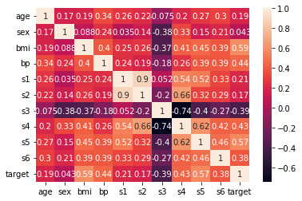


```python
sn.pairplot(frame);
```

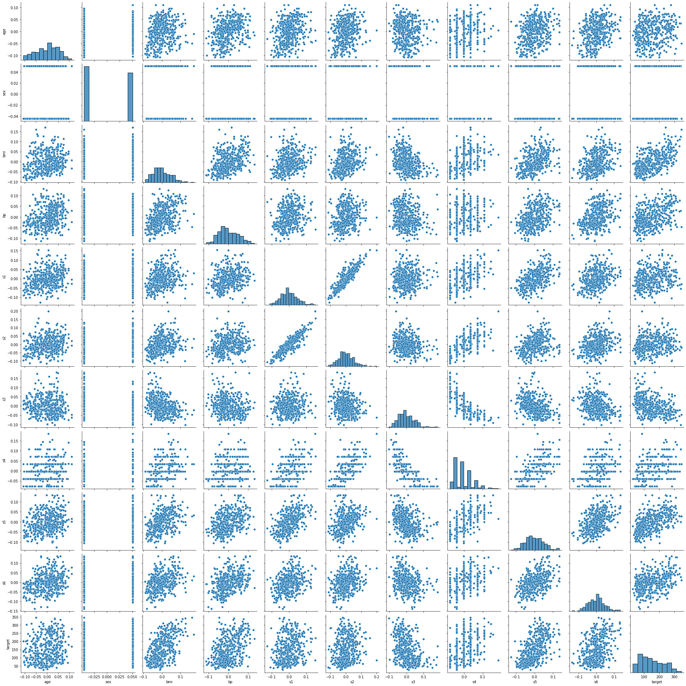

Por questões de aprendizado, a base de dados será dividida em duas:

1.  original

2.  original sem as colunas: 'age', 'sex', 's2' (motivo: correlação com target menor que 0,2 (em módulo))


```python
# base de dados modificada
frame_mod = frame.copy()
excluir = ['age', 'sex', 's2']
frame_mod = frame_mod.drop(columns=excluir)
frame_mod.describe()
```


<div>
<style scoped>
    .dataframe tbody tr th:only-of-type {
        vertical-align: middle;
    }

    .dataframe tbody tr th {
        vertical-align: top;
    }

    .dataframe thead th {
        text-align: right;
    }
</style>
<table border="1" class="dataframe" style='font-size:90%'>
  <thead>
    <tr style="text-align: right;">
      <th></th>
      <th>bmi</th>
      <th>bp</th>
      <th>s1</th>
      <th>s3</th>
      <th>s4</th>
      <th>s5</th>
      <th>s6</th>
      <th>target</th>
    </tr>
  </thead>
  <tbody>
    <tr>
      <th>count</th>
      <td>4.420000e+02</td>
      <td>4.420000e+02</td>
      <td>4.420000e+02</td>
      <td>4.420000e+02</td>
      <td>4.420000e+02</td>
      <td>4.420000e+02</td>
      <td>4.420000e+02</td>
      <td>442.000000</td>
    </tr>
    <tr>
      <th>mean</th>
      <td>-8.013951e-16</td>
      <td>1.289818e-16</td>
      <td>-9.042540e-17</td>
      <td>-4.563971e-16</td>
      <td>3.863174e-16</td>
      <td>-3.848103e-16</td>
      <td>-3.398488e-16</td>
      <td>152.133484</td>
    </tr>
    <tr>
      <th>std</th>
      <td>4.761905e-02</td>
      <td>4.761905e-02</td>
      <td>4.761905e-02</td>
      <td>4.761905e-02</td>
      <td>4.761905e-02</td>
      <td>4.761905e-02</td>
      <td>4.761905e-02</td>
      <td>77.093005</td>
    </tr>
    <tr>
      <th>min</th>
      <td>-9.027530e-02</td>
      <td>-1.123996e-01</td>
      <td>-1.267807e-01</td>
      <td>-1.023071e-01</td>
      <td>-7.639450e-02</td>
      <td>-1.260974e-01</td>
      <td>-1.377672e-01</td>
      <td>25.000000</td>
    </tr>
    <tr>
      <th>25%</th>
      <td>-3.422907e-02</td>
      <td>-3.665645e-02</td>
      <td>-3.424784e-02</td>
      <td>-3.511716e-02</td>
      <td>-3.949338e-02</td>
      <td>-3.324879e-02</td>
      <td>-3.317903e-02</td>
      <td>87.000000</td>
    </tr>
    <tr>
      <th>50%</th>
      <td>-7.283766e-03</td>
      <td>-5.670611e-03</td>
      <td>-4.320866e-03</td>
      <td>-6.584468e-03</td>
      <td>-2.592262e-03</td>
      <td>-1.947634e-03</td>
      <td>-1.077698e-03</td>
      <td>140.500000</td>
    </tr>
    <tr>
      <th>75%</th>
      <td>3.124802e-02</td>
      <td>3.564384e-02</td>
      <td>2.835801e-02</td>
      <td>2.931150e-02</td>
      <td>3.430886e-02</td>
      <td>3.243323e-02</td>
      <td>2.791705e-02</td>
      <td>211.500000</td>
    </tr>
    <tr>
      <th>max</th>
      <td>1.705552e-01</td>
      <td>1.320442e-01</td>
      <td>1.539137e-01</td>
      <td>1.811791e-01</td>
      <td>1.852344e-01</td>
      <td>1.335990e-01</td>
      <td>1.356118e-01</td>
      <td>346.000000</td>
    </tr>
  </tbody>
</table>
</div>


## PARTE 3: Pré-processamento

Dois procedimentos comuns de pré-processamento já são garantidos pela base de dados utilizada:

1.  Normalizar os dados de acordo com a média e desvio padrão;

2.  Transformar dados categóricos em valores numéricos (python: sklearn.preprocessing.OneHotEncoder).

    Exemplo: como o algoritmo não entenderia o que é 'masculino' e 'feminino', a variável 'sex' já se encontra transformada para valores numéricos.

Só será verificado se existe alguma instância com valor NA. Caso positivo, esta será excluída. E também se existirem instâncias duplicadas.


```python
# verificar valores NA
frame.dropna(inplace=True)
frame_mod.dropna(inplace=True)

# verificar valores duplicados
frame.drop_duplicates(inplace=True)
frame_mod.drop_duplicates(inplace=True)

# shape após verificação (inicialmente são 442 instâncias)
print(f'Shape base original: {frame.shape} \nShape base modificada: {frame_mod.shape}')
```


    Shape base original: (442, 11) 
    Shape base modificada: (442, 8)


Finalizado o pré-processamento da base de dados, é necessário dividir o conjunto entre (data, target).

Apesar de isso já ter sido feito no início quando a base foi importada, o procedimento precisa ser refeito, pois no pré-processamento foi utilizada a base completa.

```python
# a variável 'y' é o atributo 'target', o restante compõe a variável 'X'
X, y = frame.iloc[:, :-1], frame.iloc[:, -1]
X_mod, y_mod = frame_mod.iloc[:, :-1], frame_mod.iloc[:, -1]
```


## PARTE 4: Dividir base de dados para treinamento e validação


```python
X_train, X_test, y_train, y_test = train_test_split(X, y, test_size=0.3, random_state=42)
X_train_mod, X_test_mod, y_train_mod, y_test_mod = train_test_split(X_mod, y_mod, test_size=0.3, random_state=42)


print(f'Base Original\nShape treino: {X_train.shape} \nShape teste: {X_test.shape}')
print(f'Shape treino (target): {y_train.shape} \nShape teste (target): {y_test.shape}')
print(f'\nBase Modificada\nShape treino: {X_train_mod.shape} \nShape teste: {X_test_mod.shape}')
print(f'Shape treino (target): {y_train_mod.shape} \nShape teste (target): {y_test_mod.shape}')
```


    Base Original
    Shape treino: (309, 10) 
    Shape teste: (133, 10)
    Shape treino (target): (309,) 
    Shape teste (target): (133,)

    Base Modificada
    Shape treino: (309, 7) 
    Shape teste: (133, 7)
    Shape treino (target): (309,) 
    Shape teste (target): (133,)


## PARTE 5: Métodos de Regressão

Criar os modelos para cada método e armazenar os resultados das respectivas predições, considerando as duas bases de dados (original e modificada).

```python
## Regressão Linear - Base Original
lin = LinearRegression()
lin.fit(X_train.values, y_train)
y_pred_lin = lin.predict(X_test.values)

## Regressão Linear - Base Modificada
lin_mod = LinearRegression()
lin_mod.fit(X_train_mod.values, y_train_mod)
y_pred_lin_mod = lin_mod.predict(X_test_mod.values)

## Árvore de Decisão - Base Original
arv_dec = DecisionTreeRegressor(min_samples_split=20)
arv_dec.fit(X_train.values, y_train)
y_pred_arv = arv_dec.predict(X_test.values)

## Árvore de Decisão - Base Modificada
arv_dec_mod = DecisionTreeRegressor(min_samples_split=20)
arv_dec_mod.fit(X_train_mod.values, y_train_mod)
y_pred_arv_mod = arv_dec_mod.predict(X_test_mod.values)

## Random Forest - Base Original
rf = RandomForestRegressor(n_estimators=100, random_state=0)
rf.fit(X_train.values, y_train)
y_pred_rf = rf.predict(X_test.values)

## Random Forest - Base Modificada
rf_mod = RandomForestRegressor(n_estimators=100, random_state=0)
rf_mod.fit(X_train_mod.values, y_train_mod)
y_pred_rf_mod = rf_mod.predict(X_test_mod.values)

## SVR - Base Original
svm = SVR(kernel="poly", C=100, gamma="auto", degree=3, epsilon=0.1, coef0=1)
svm.fit(X_train.values, y_train)
y_pred_svm = svm.predict(X_test.values)

## SVR - Base Modificada
svm_mod = SVR(kernel="poly", C=100, gamma="auto", degree=3, epsilon=0.1, coef0=1)
svm_mod.fit(X_train_mod.values, y_train_mod)
y_pred_svm_mod = svm_mod.predict(X_test_mod.values)
```

## PARTE 6: Avaliação das Métricas

```python
def calcular_metricas(y_test, y_pred):
    ev = np.round(metrics.explained_variance_score(y_test, y_pred),3)
    mse = np.round(metrics.mean_squared_error(y_test,y_pred,squared=True),3)
    r2 = np.round(metrics.r2_score(y_test, y_pred),3)
    return ev, mse, r2
```

```python
## Regressão Linear - Base Original
ev_lin, mse_lin, r2_lin = calcular_metricas(y_test, y_pred_lin)

## Regressão Linear - Base Modificada
ev_lin_mod, mse_lin_mod, r2_lin_mod = calcular_metricas(y_test_mod, y_pred_lin_mod)

## Árvore de Decisão - Base Original
ev_arv, mse_arv, r2_arv = calcular_metricas(y_test, y_pred_arv)

## Árvore de Decisão - Base Modificada
ev_arv_mod, mse_arv_mod, r2_arv_mod = calcular_metricas(y_test_mod, y_pred_arv_mod)

## Random Forest - Base Original
ev_rf, mse_rf, r2_rf = calcular_metricas(y_test, y_pred_rf)

## Random Forest - Base Modificada
ev_rf_mod, mse_rf_mod, r2_rf_mod = calcular_metricas(y_test_mod, y_pred_rf_mod)

## SVR - Base Original
ev_svm, mse_svm, r2_svm = calcular_metricas(y_test, y_pred_svm)

## SVR - Base Modificada
ev_svm_mod, mse_svm_mod, r2_svm_mod = calcular_metricas(y_test_mod, y_pred_svm_mod)
```

### Variância Explicada

```python
## Base Original
y = [ev_lin, ev_arv, ev_rf, ev_svm]
legenda = ["Reg. Linear", "Árvore de Dec.", "RF", "SVR"]
x = np.arange(len(y))

plt.figure(0)
plt.bar(x, y)
plt.xticks(x, legenda)
plt.ylim([0, 1])
plt.title('Variância Explicada - Base Original')
plt.ylabel('Valores')


## Base Modificada
y1 = [ev_lin_mod, ev_arv_mod, ev_rf_mod, ev_svm_mod]
legenda1 = ["Reg. Linear", "Árvore de Dec.", "RF", "SVR"]
x1 = np.arange(len(y1))

plt.figure(1)
plt.bar(x1, y1)
plt.xticks(x1, legenda1)
plt.ylim([0, 1])
plt.title('Variância Explicada - Base Modificada')
plt.ylabel('Valores')


plt.show()
```


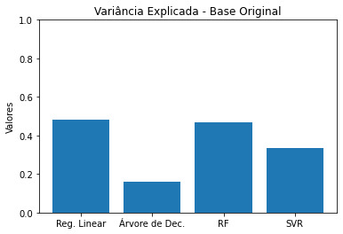


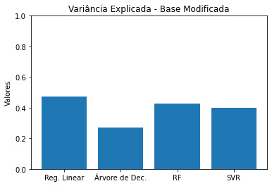


### MSE

```python
## Base Original
y = [mse_lin, mse_arv, mse_rf, mse_svm]
legenda = ["Reg. Linear", "Árvore de Dec.", "RF", "SVR"]
x = np.arange(len(y))

plt.figure(0)
plt.bar(x, y)
plt.xticks(x, legenda)
plt.ylim([0, 5000])
plt.title('MSE - Base Original')
plt.ylabel('Valores')


## Base Modificada
y1 = [mse_lin_mod, mse_arv_mod, mse_rf_mod, mse_svm_mod]
legenda1 = ["Reg. Linear", "Árvore de Dec.", "RF", "SVR"]
x1 = np.arange(len(y1))

plt.figure(1)
plt.bar(x1, y1)
plt.xticks(x1, legenda1)
plt.ylim([0, 5000])
plt.title('MSE - Base Modificada')
plt.ylabel('Valores')


plt.show()
```

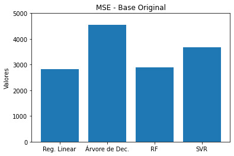


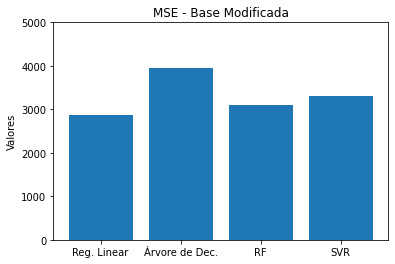


### R2
```python
## Base Original
y = [r2_lin, r2_arv, r2_rf, r2_svm]
legenda = ["Reg. Linear", "Árvore de Dec.", "RF", "SVR"]
x = np.arange(len(y))

plt.figure(0)
plt.bar(x, y)
plt.xticks(x, legenda)
plt.ylim([0, 1])
plt.title('R2 - Base Original')
plt.ylabel('Valores')


## Base Modificada
y1 = [r2_lin_mod, r2_arv_mod, r2_rf_mod, r2_svm_mod]
legenda1 = ["Reg. Linear", "Árvore de Dec.", "RF", "SVR"]
x1 = np.arange(len(y1))

plt.figure(1)
plt.bar(x1, y1)
plt.xticks(x1, legenda1)
plt.ylim([0, 1])
plt.title('R2 - Base Modificada')
plt.ylabel('Valores')


plt.show()
```

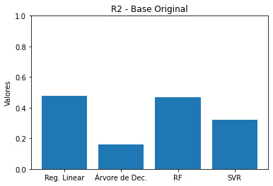


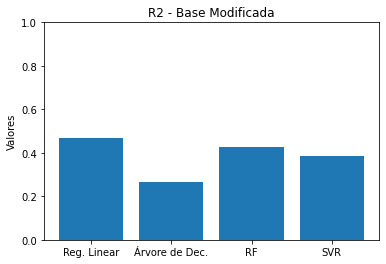


### Análise

Percebe-se que modificar a base de dados excluindo três atributos com base em um limiar de correlação com o target não alterou consideravelmente a performance dos algoritmos. Dessa forma, adiante serão avaliados apenas os resultados dos métodos que utilizam a base de dados original.

Os melhores resultados (i.e. Variância Explicada e R2 mais próximos de 1 e menor MSE) são obtidos ao utilizar Regressão Linear e Random Forest, com o primeiro sendo superior.

## PARTE 7: Influência dos atributos nos resultados

É de suma importância entender os fatores que influenciaram em um determinado resultado de um método de aprendizado de máquina. Neste projeto, utilizarei o conceito de SHAP Values (SHapley Additive exPlanations) que, resumidamente, analisa a contribuição marginal de cada atributo em cada saída.

[Mais sobre](https://towardsdatascience.com/explain-your-model-with-the-shap-values-bc36aac4de3d)


```python
## Regressão Linear - Base Original
lin_explainer = shap.Explainer(lin.predict, X_train.values)
lin_shap_values = lin_explainer(X_test)
shap.plots.beeswarm(lin_shap_values)
```

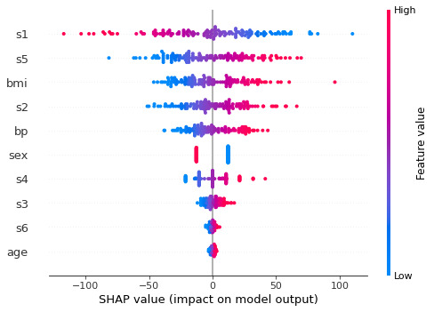


```python
## Árvore de Decisão - Base Original
ex = shap.TreeExplainer(arv_dec)
shap_values = ex.shap_values(X_test)
shap.summary_plot(shap_values, X_test)
```

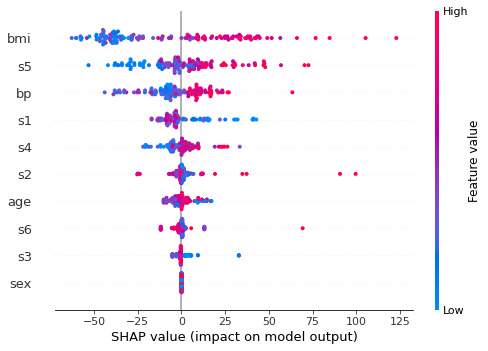


```python
## Random Forest - Base Original
ex = shap.TreeExplainer(rf)
shap_values = ex.shap_values(X_test)
shap.summary_plot(shap_values, X_test)
```

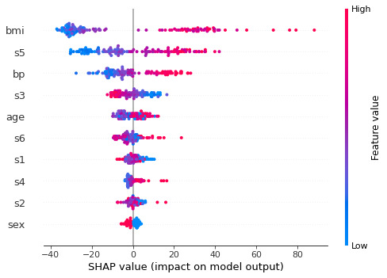


```python
## SVR - Base Original
X_train_summary = shap.kmeans(X_train.values, 10)
svm_explainer = shap.KernelExplainer(svm.predict, X_train_summary)
svm_shap_values = svm_explainer.shap_values(X_test)
shap.summary_plot(svm_shap_values, X_test)
```


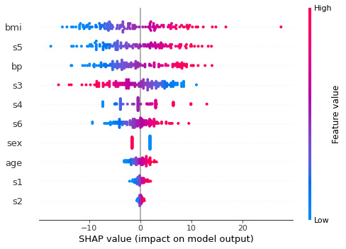


## PARTE 8: Discussão

Os parâmetros 'bmi' (índice de massa corporal) e 's5' (concentração sérica de triglicerídeos) estão entre os 3 de maior influência nos resultados em todos os algoritmos. De maneira proporcional, quanto maiores 'bmi' e 's5', maiores as chances de progressão da doença.

A regressão linear foi o único método que considerou o parâmetro 's1' (nível sérico de colesterol total) como o de maior contribuição marginal (quanto maior 's1', menores as chances de progressão da doença). Também é o único que não tem 'bp' (pressão arterial média) entre os 3 parâmetros de maior relevância.

Importante salientar que os resultados observados utilizando os valores SHAP não necessariamente implicam em causalidade entre os parâmetros e a progressão da doença, essa é uma maneira de observar aquilo que o algoritmo considera como relevante para chegar em um determinado valor de target. Quaisquer afirmações sobre esses relacionamentos devem ser cuidadosas e contar com a colaboração de profissionais da área da saúde.

